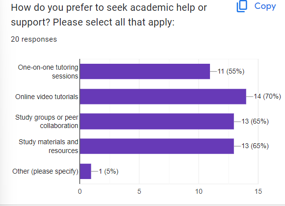
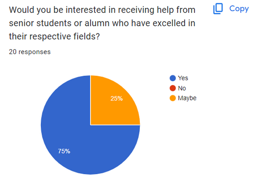
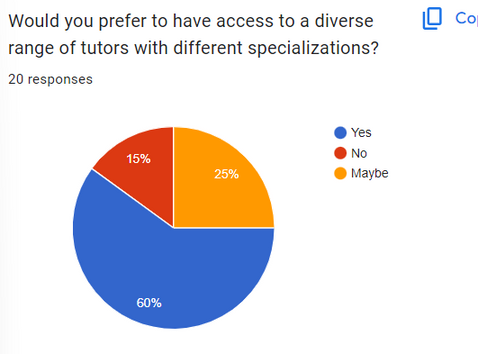
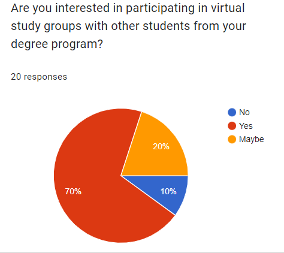
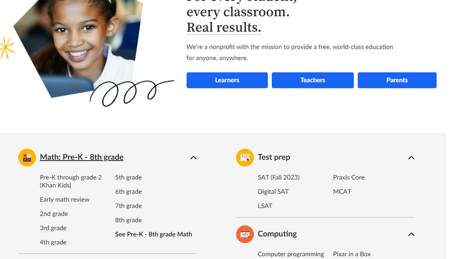
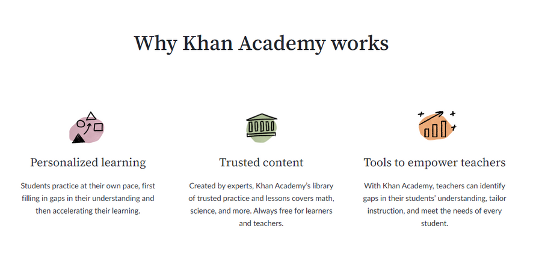
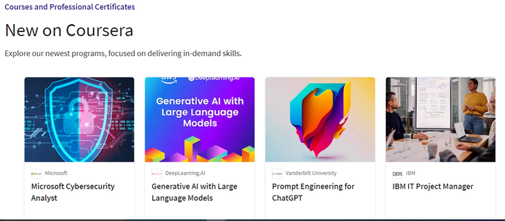
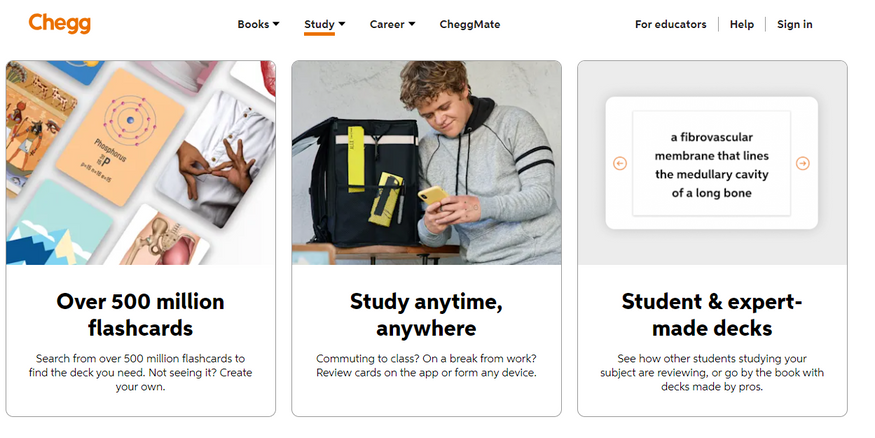
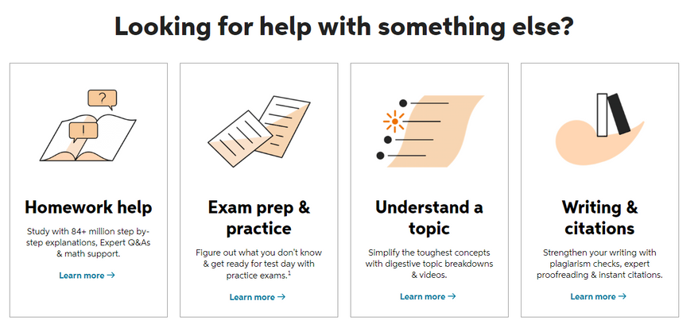

<h1>Students Assistance Websites for IMY320</h1>

### **INTRODUCTION**

In today's dynamic educational landscape, the demand for a comprehensive and user-friendly platform that empowers students has never been more critical. This proposal outlines the creation of a student assistance website that goes beyond traditional study materials.

### **OUR VISION**

  Our vision is to establish a vibrant online community that connects students, fosters collaboration, offers personalized tutoring, facilitates virtual study sessions, and assists in effective study schedule management. The core theme of the website, "Learning Network Nexus," underlines our commitment to student success through collective support and accessible resources.


<details>
  <summary><h1>Website Url</h1></summary>
  <div class="content"><a href="https://bobstudentassistance.web.app">BOB Website</a></div></details>


<details>
  <summary><h1>Prerequisites</h1></summary>
  <div class="content">
    <!-- Your content goes here -->
    Instructions for setting up and running the project:

**Prerequisites:**

1. **Download Git:** Get Git from [https://git-scm.com/downloads](https://git-scm.com/downloads).
2. **Clone the Repository:** Clone the project repository using the following URL: [https://github.com/ThaboLetsoalo/IMY320_BOTTLE_OF_BREAD](https://github.com/ThaboLetsoalo/IMY320_BOTTLE_OF_BREAD).
3. **Install Node.js:** Download and install Node.js from [https://nodejs.org/en/download](https://nodejs.org/en/download).
4. **Install Angular:** Open your command prompt and run the following command to install Angular CLI globally:

   ```shell
   npm install -g @angular/cli
   ```
5. **Install Ionic:** Install the Ionic CLI globally with the following command:

   ```shell
   npm install -g @ionic/cli
   ```
6. **Install Yarn:** Install Yarn globally by running:

   ```shell
   npm install -g yarn
   ```

</div>
</details>


<details>
<summary><h1>Running the Project</h1></summary>
  <div class="content">

1. **Install Dependencies:** In your project's root directory(BOB), install project dependencies using Yarn:

   ```shell
   yarn
   ```
2. **Run the Project:** Navigate to the project's root directory(BOB) and execute the following command:

   ```shell
   ng serve
   ```

After a successful build, open your web browser and enter the following URL:

   [http://localhost:4200](http://localhost:4200)

</div>
</details>


<details>
  <summary><h1>Generating Pages and Components:</h1></summary>
  <div class="content">
   To generate pages and components, use the following commands:

- **Generate Pages:** Create a new page by running the command:

  ```shell
  ionic generate page <page_directory & name>
  ```
- **Generate Components:** Generate a new component with the command:

  ```shell
  ionic generate component <component_directory & name>
  ```

**File Names and Their Purposes:**

- **.module.ts:** This file serves as a module file, allowing the grouping of similar components. It handles importing and exporting of modules.
- **.html:** This file contains your markup, where you define the presentation logic of your application.
- **.scss:** Use this file for styling your components and pages.
- **.ts:** This file holds the Angular logic, including component classes, variables, and functions.
  </div>

</details>

<details>
  <summary> <h1>Proposal<h1></summary>
  <div class="content">

**#OUR TEAM**

* **Tinashe Austin.**
* **Risenga Sono.**
* **Thabo Letsoalo.**
* **Mduduzi Sibiya.**
* **Netshifhefhe Unarine.**

# INTRODUCTION

  In today's dynamic educational landscape, the demand for a comprehensive and user-friendly platform that empowers students has never been more critical. This proposal outlines the creation of a student assistance website that goes beyond traditional study materials.

### **OUR VISION**

  Our vision is to establish a vibrant online community that connects students, fosters collaboration, offers personalized tutoring, facilitates virtual study sessions, and assists in effective study schedule management. The core theme of the website, "Learning Network Nexus," underlines our commitment to student success through collective support and accessible resources.

# MARKET RESEARCH OVERVIEW

  In guidance for this initiative, sizable marketplace research was conducted. This evaluation involved careful evaluation of current educational structures and scholar support web sites, including Khan Academy, Coursera, and StudyBlue. By figuring out user alternatives, layout trends, and important functions, we've got distilled valuable insights that guide our challenge's direction. Additionally, a survey was administered to University of Pretoria students, soliciting insights into their support requirements, 20 random students doing various courses filled our survey. The data gathered from this survey played a pivotal role in shaping the project's approach and identifying the 5 functional requirements.

# FUNCTIONAL REQUIREMENTS AND JUSTIFICATION

1. Availability of online video tutorials and study resources
2. Academic support by means of study groups and peer collaborations
3. Assistance from alumni on a specific module student is struggling on
4. Collaboration amongst students whereby they can form study groups
5. Collaboration amongst students whereby they can form study groups.

# 1st & 2nd FUNCTIONAL REQUIREMENT

  

  Our First functional requirement is The availability of online video tutorials and study resources, These received 70% and 65% in terms of how students prefer to seek academic help and support, thus this will be a feature supported on our Website.

  Our second functional requirement is based on the fact that 65% of students seek academic support by means of study groups and peer collaborations hence we included it as a requirement.

# 3rd FUNCTIONAL REQUIREMENT

              

  Our third functional requirement is based on 75% of the students responding yes to receiving help from alumni students who have excelled in the modules they require help with and 25% said maybe, due to no student responding No and a higher percentage of Yes, access to online tutors with reputable results in the modules they wish to tutor would be a functional requirement.

# 4th FUNCTIONAL REQUIREMENT

  

  Because 70% of students want to participate in study groups, we have incorporated a dashboard as part of the functional requirements to track progress, schedule meetings, and view progress on quizzes.

# 5th FUNCTIONAL REQUIREMENT

  Our fifth functional requirement is based on 85% of students responding that they would want problem-solving practice exercises so our website will support this as well by providing access to practice material and exercises.

# EXISTING PRODUCTS

  To Guide the ideation process we looked at a few existing websites with similar themes and ideas, we also looked at other websites that contain elements we thought would be great to incorporate in the design.

# KHAN ACADEMY

1. **Engaging and Comprehensive Content.**
   Engaging content captures and maintains the attention of students, making the learning experience enjoyable and effective. Comprehensive content covers a wide range of topics, ensuring that students can find the help they need.

   Importance : if the content is dull or incomplete, students will lose interest quickly, leading to limited learning outcomes. By offering a wide variety of engaging and comprehensive materials, students are more likely to stay motivated and achieve better results.
2. **Adaptive Learning Technology.**

   Adaptive learning tailors the educational experience to the individual student's level, pace, and learning style. This personalization improves comprehension and retention.

   Importance : Not all students learn at the same pace or in the same way. Adaptive learning ensures that each student gets a customized learning path, making the experience more effective and efficient. It addresses the diverse needs of learners, enhancing overall satisfaction.
3. **User-Friendly Interface.**

   A user-friendly interface enhances accessibility and ease of use. It reduces frustration and allows students to focus on learning rather than struggling with navigation.

   Importance : A confusing or complex interface can discourage students from using the website. A simple, intuitive design with clear navigation ensures that students can quickly find the resources they need. A responsive layout makes the website accessible on different devices, catering to the preferences and convenience of the users.

# KHAN ACADEMY(PICTURES)

  

  

# COURSERA

1. **Diverse Course Offerings:**

   Coursera provides a wide range of courses across various subjects, levels, and institutions. This diversity caters to different interests and learning needs.

   Importance : A diverse selection of courses ensures that students can find help for a multitude of topics. When creating a student help website, offering a variety of resources allows you to attract a broader audience, catering to the diverse interests and academic requirements of students.
2. **Verified Certificates and Recognized Institutions:**

   Coursera partners with reputable universities and institutions, offering verified certificates upon course completion. This adds credibility and recognition to the learning experience.

   Importance : Collaboration with respected institutions and providing verifiable certificates can enhance the reputation of your student help website. It builds trust among users, validating the quality of the content and the skills acquired, which can be valuable for learners' resumes.
3. **Structured Learning Paths:**

   Coursera often offers courses in series, allowing students to follow structured learning paths and earn specialization certificates.

   Importance : Providing structured learning paths can help guide students through their academic journey. By organizing resources in a logical sequence or offering specialized tracks, your website can help students navigate their learning more effectively, leading to better understanding and skill development.

# COURSER (PICTURES)

  

  

  

# CHEGG/STUDYBLUE

1. **Engaging and Comprehensive Content:**

   StudyBlue allows students to create and share digital flashcards, quizzes, and study guides, making learning more interactive and engaging.

   Importance: Interactive study materials can be a fantastic way to engage students. On your student help website, incorporating interactive elements like quizzes, flashcards, and collaborative study guides can enhance the learning experience, making it more enjoyable and effective.
2. **Adaptive Learning Technology:**

   StudyBlue facilitates collaboration among students by allowing them to share study materials and collaborate on content creation.

   Importance: Fostering a sense of community and collaboration can be essential for a student help website. Creating features that allow students to share their own study materials, discuss topics, and work together on challenging problems can create a supportive and engaging environment.
3. **Mobile Accessibility:**

   StudyBlue has a mobile app, enabling students to access study materials on the go.

   Importance: Mobile accessibility is crucial in today's digital landscape. Ensuring that your student help website is mobile-friendly or has a dedicated app can significantly expand your reach and cater to the convenience of students who often use their smartphones or tablets for learning.

# CHEGG(PICTURES)

  

  

# COLOUR CHOICES

  The blue and green color combination is often used in a complementary manner, creating a sense of openness and informality while maintaining a level of seriousness. This blend of colors brings a peaceful harmony that adds a subtle dynamic quality, working together effectively. When aiming to capture learners' attention, this color pairing is useful because it presents serious educational content or services in a more fun and inviting manner, making the overall visual experience less monotonous. To optimize this color scheme on an educational website, it's important to ensure sufficient contrast between the blue and green hues. Source Reference: Verpex Blog, "Best Color Combinations for Educational Websites" (URL: https://verpex.com/blog/website-tips/best-color-combinations-for-educational-websites)

1. Backgrounds: We Opted for a softer, light shade for the background, allowing content to stand out against the soothing backdrop. A pale blue or mint green (#B0E0E6) provides a gentle and inviting canvas.
2. Buttons & Text Links: Utilize a slightly darker or more vibrant shade for buttons and text links, creating a visually appealing contrast that draws learners' attention. A deeper blue or forest green (#006699) can add a touch of seriousness and ensure essential elements are noticed.
3. Lively Green: A shade that conveys energy and freshness while harmonizing with the serene blue background for accents.

# LAYOUT OF THE PAGES

#### General Layout of Pages

  Research shows humans process visuals 60,000 times faster than text, retaining 80% of what they see. Hence, balancing visual and written content is crucial for our website. (Marc Avila 2020).

  To minimize user frustration and improve engagement, we will prioritize important information upfront. This reduces the risk of users leaving due to difficulty finding desired information. (Marc Avila 2020).

  To ensure readability for all users, we will use neat fonts and avoid using light font colors on light backgrounds or pale fonts on dark backgrounds. (Mike St. Jean 2020).

#### Layout for specific pages

##### Home Page

  Provides a comprehensive overview of its features, including captivating images and engaging elements that highlight study materials, collaboration, tutors, group/course management, and practice resources.

##### Study Materials Page

  Offers access to resources like notes and organizes them effectively, and implements a search bar for easy navigation and finding materials for students.

##### Study groups Page

  Has tools for group management, enabling users to create and manage study groups, as well as search for available groups. Will also have a discussion tab for the group members.

##### Alumni/Tutor Page

  This page will list reputable tutors, will include profiles of the tutors including their qualifications, expertise, and reviews from students. It should also provide an easy way for students to contact or book sessions with the tutors.

##### Support & Help Page

  Assists the user with common problems and also has a form that the user can submit to tell us their issue.

# NAVIGATION

#### Navigation Between Pages

  We intend to incorporate a sticky navigation bar on all pages of our website. This feature will ensure that users can effortlessly navigate to different pages, regardless of their scrolling depth on the current page. (Anadia 2019).

# SITE STRUCTURE AND INTEGRATION

  The structure of the website emphasizes clarity and logic. A user-friendly navigation menu guides visitors seamlessly through different sections, ensuring intuitive navigation. Moreover, integration with popular video conferencing and scheduling tools amplifies the effectiveness of virtual study sessions and scheduling features.

# WIREFRAME

#### [figma link to wireframe HERE](https://www.figma.com/proto/7h4kzVZITacGqXVJksqce3/Untitled?page-id=0%3A1&type=design&node-id=75-3&viewport=-492%2C-288%2C0.21&t=ak7vSt8gYciMJvev-1&scaling=scale-down&starting-point-node-id=75%3A3&mode=design)

1. Home Page:

   - Welcome message and overview of the platform.
   - Navigation menu for different sections.
2. Study Materials Page:

   - Categories for study materials (e.g., notes, exam papers, resources).
   - Thumbnails and links to specific study materials within each category.
3. Tutors/Alumni Profiles Page:

   - List of profiles with photos and short descriptions.
   - Option to click on a profile to view more details and contact information.
4. Online Video Tutorials/Tutorials Page:

   - List of available video tutorials or written tutorials.
   - Thumbnails and titles for each tutorial, along with a brief description.
   - Links to view the tutorials.
5. Virtual Study Tiles/Group Study Page:

   - Option to create or join virtual study groups or sessions.
   - Information about ongoing or upcoming study groups.
   - Links to enter virtual study sessions.
6. Support and Help Page:

   - Information on how to get support or assistance.
   - Contact details, FAQs, and troubleshooting guides.
7. Calendar and Scheduling Page:

   - Calendar displaying important dates, events, and study sessions.
   - Option to schedule one-on-one or group study sessions.
   - Ability to set reminders and notifications.
8. Authentication and User Profiles:

   - Login/Registration page for users to create accounts or log in.
   - User profiles with personal details, profile picture, and study preferences.
   - Settings to manage account preferences and notifications.
9. Dashboard/Personalized Homepage:

   - Personalized overview of upcoming study sessions, calendar events, and notifications.
   - Quick access to frequently used features like study materials, tutorials, and study groups.

# PERSONA AND USER JOURNEY

  At the heart of our project is "Naledi," an embodiment of a college student's aspirations. As Naledi navigates through the homepage, she discovers various sections, including study materials, tutor profiles, and virtual study sessions. She engages with resources and tutors, attends virtual study sessions, and manages her study schedule efficiently with calendar features. If challenges arise, Naledi promptly accesses the "Support and Help" page. The personalized dashboard ensures a seamless overview of upcoming events and essential features.

# REFERENCE

  Avila, M. (2020, JANUARY, 05). Designing a Successful Education Website. https://www.3mediaweb.com/blog/designing-a-successful-education-website/..).

  Jean, M. S. ((2020, MAY, 05). How to Design an ADA Compliant Website [FREE Checklist]. https://www.3mediaweb.com/blog/7-steps-to-make-sure-your-website-is-ada-compliant/.

  Anadea. (2019, April 4). Sticky Navigation: Is it Worth It? https://anadea.info/blog/sticky-navigation-is-i.

</div>
</details>
